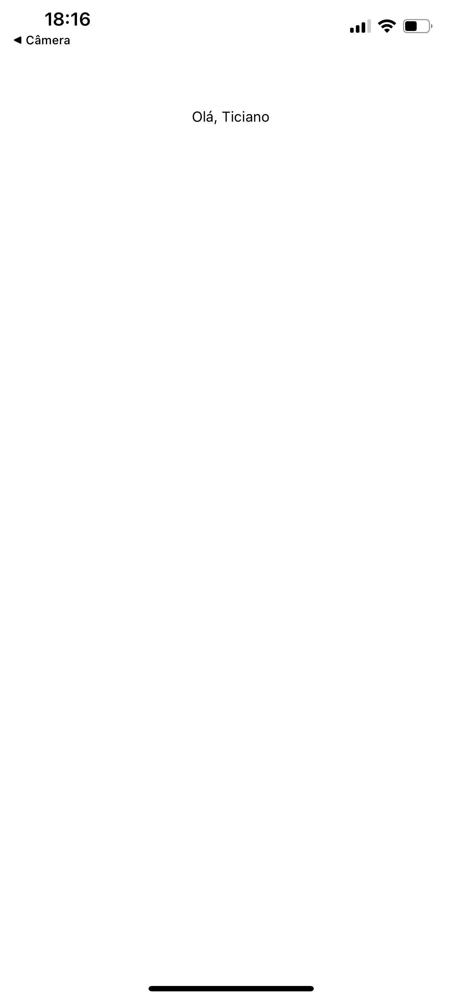
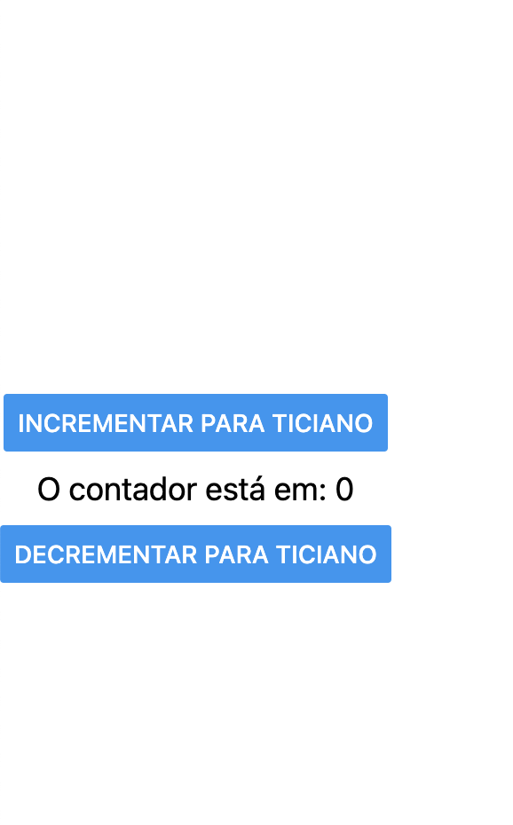

# PROGRAMAÇÃO DE DISPOSITIVOS MÓVEIS
 Material de estudos e prática da disciplina Programação de dispositivos móveis, ultilizando React Native, ministrado pelo professor Kelson na turma P5 de 2025.1.
p/ Bons estudos.

